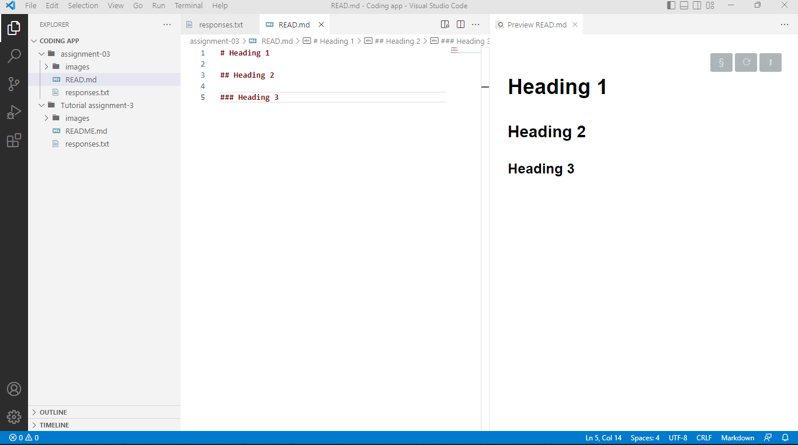

# Heading 1

## Heading 2

### Heading 3

### 3 things I have learned in class so far is 
1. how to code list
2. That the world wide web is a web because of how much the interconnectiveness of all the different webpages and websites that can be accessed by anyone with had access to the interent, which is not the same thing, looks likes a web. 
3. That Markdown elements is a misnommer as it actually Marks-up the elements of your code. Like making things **bold** or *italic* and the many other things Markdown elements do. 

### [My File Responses](responses.txt)

