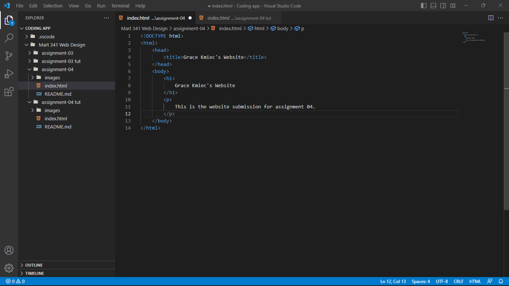

A browser is a way for you to access the interent from a device. It takes the instuctions written in web languages, such as HTML or CSS, and interputs and render, using a rendering engine, into the desired layout, content, etc. The browser engine acts as middle man between the user and/or external communications and the rendering engine. The "intelligence" or fuctionallity of a page comes from the javascript intrupator. It also stores some amount of data, such as cookies and local storage. But in order for all of this to take place it the browser has to be connect to a network, so it can retrive images, files, communicate, etc. 
I used Google Chrome as my main web browser. I like the interconnective between the google products and sites. 

