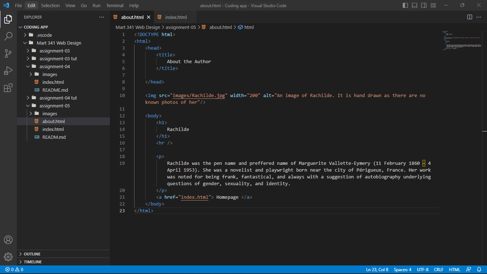

The website I visited using the wayback machine was Tumblr.com. I visited on 01/05/2007, the day the website was published. It was plain. The first version of the site, did not have its signiture blue background or the name of the website right. It was called Tumbleblogs (Gross!) And it have 3 links, log in, sign up, and FAQ. I could not make a post based on weather it was an image, text, video, link, etc. It was like looking at a human baby and comparing it it to a human adult. Just not right.

