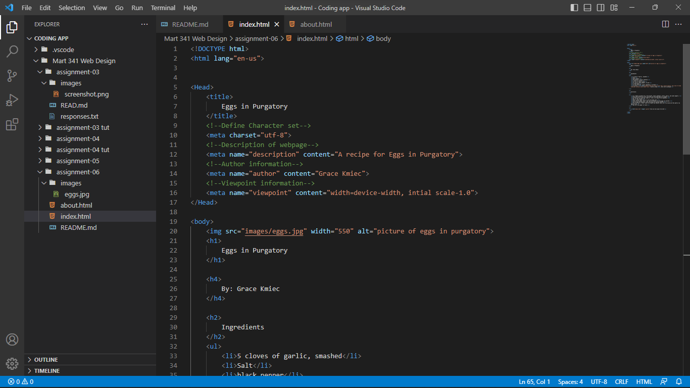

The difference between Semantic and Structural markups is their purpose. Sematic explains what the markup does, such as <em></em> meaning adding emphsis to a word or phrase. While structural explains the relationship of one context to the other contexts. 

