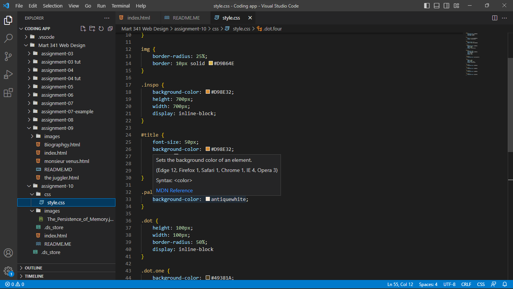

Universal selector (*) selects all HTML elements on the page Element selector selects HTML elements based on the element name. Class selector selects HTML elements with a specific class attribute. T0 select elements with a specific class, write a period (.) character, followed by the class name. Id selector uses the id attribute of an HTML element to select a specific element. To select an element with a specific id, write a hash (#) character, followed by the id of the element. Id selector are specfic or unique to the something on the page. You would choose one of the other depending on what you are style. If you are styling the whole page, you the Universal Selector. Basically you would want to use which on fits with what you are styling, is it some specfic or more of everything under the umbrella. 

I choose the colors in my palette because they were earthy tones, and when looking at The Pesistence of Memory painting, you are meet with a lot of earthy tones. I could have gone with a gold or silver, like seen on the clocks but I felt that would draw away from the painting and make it feel like one with the page. 

