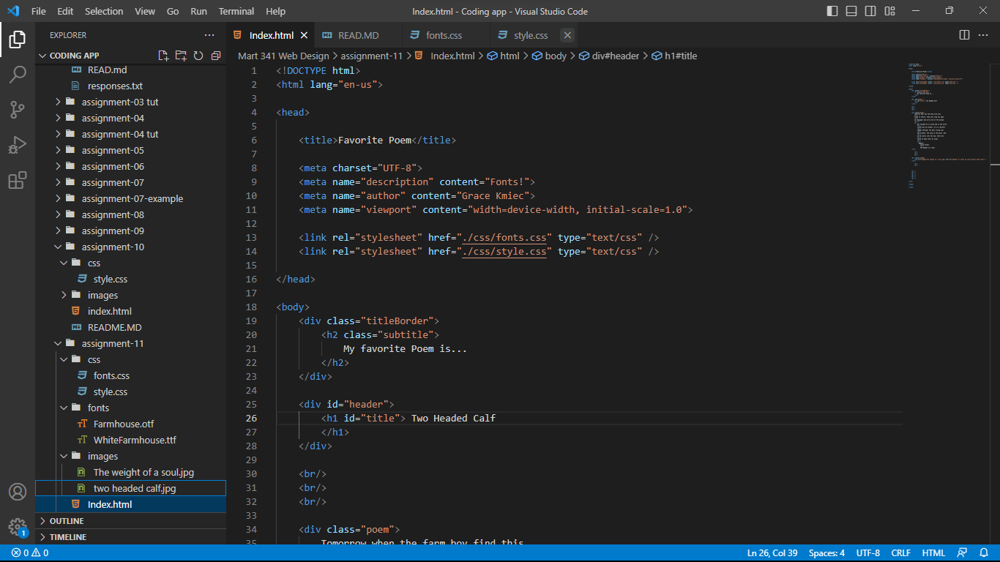

Typography is the style of text in a printed or digital media.

The importance of having a fallback font is if their client computer can not render the orginal font, it will got to a fallback font, which would, hopefully, be one that can be read by all if not most computers such Sans or Sans Serif

System fonts are on a varity of different computers, often these used in applications. Web fonts are imbedded into the website/ website code. Web Safe Font is a font on a varity of computers, and often used as a fallback font. 

