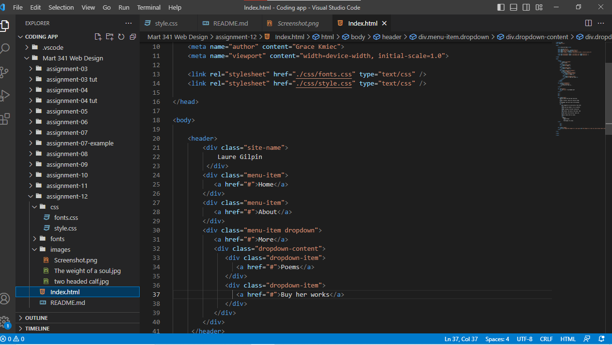

The best way I can explain the difference between padding, border, and margin is a box isnide of a box inside another box. Padding is the inner most box and goes around the content, giving the content room to breath. Border is the next box, outside of padding, wrapping it. And Margin is the outer most box, keeping everything together. 

